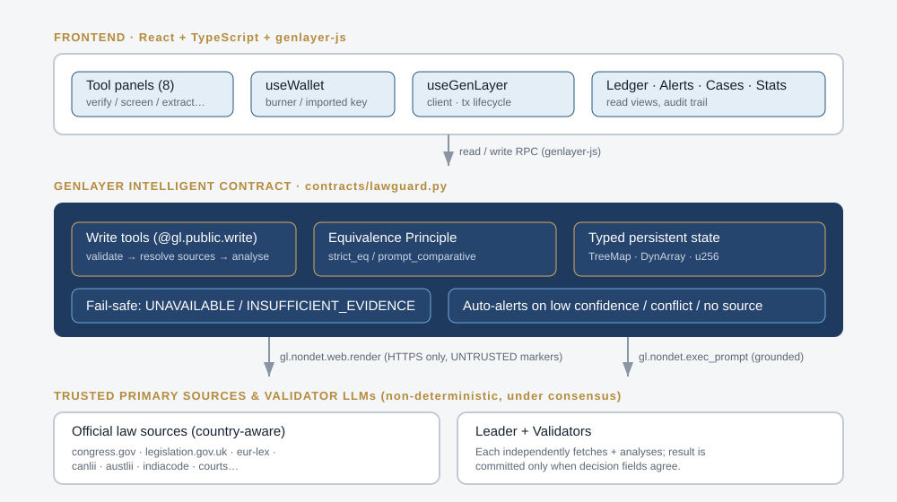
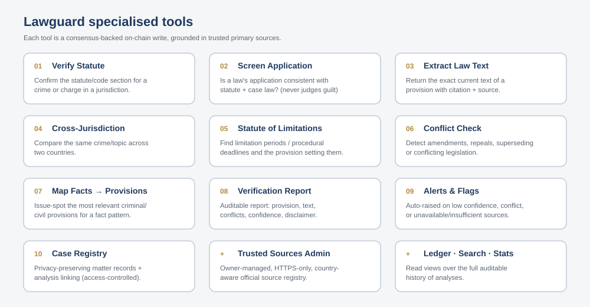
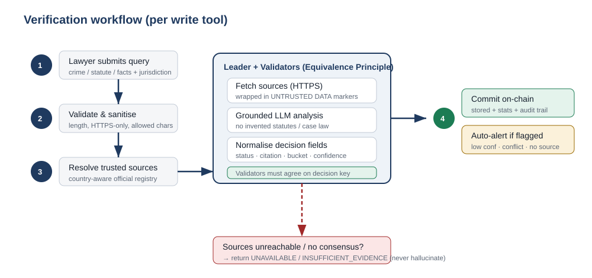

<p align="center">
  
</p>

<h1 align="center">Lawguard</h1>

<p align="center">
  <b>On-chain, source-grounded law verification &amp; decision-support for law firms.</b><br/>
  Built as a <a href="https://genlayer.com">GenLayer</a> Intelligent Contract — every analysis is grounded in trusted primary sources, validated by leader/validator consensus, and permanently auditable on-chain.
</p>

<p align="center">
  <a href="#live-demo">Live demo</a> ·
  <a href="#quick-start">Quick start</a> ·
  <a href="#tools">Tools</a> ·
  <a href="#how-consensus-works">Consensus</a> ·
  <a href="#security--safety">Security</a> ·
  <a href="#tests">Tests</a>
</p>

---

> ⚖️ **Decision-support only — not legal advice.** Lawguard **supports** lawyers and law firms.
> It does **not** practise law, does **not** give legal advice, and does **not** judge guilt,
> innocence, or outcomes. Every output is *verified reference information grounded in public
> sources* for professional review. Always consult qualified counsel.

## What Lawguard does

Lawguard helps legal teams **screen whether a law or legal claim against a person or entity is
correctly implemented / applied in any country**. It verifies and returns the correct, current
law text applicable to a crime or legal situation, grounds every AI analysis in trusted official
sources, and records the entire workflow on-chain for transparent, auditable results.

Because it runs on GenLayer, the "AI judgment" steps are not a black box: multiple validators
independently fetch the same primary sources and re-run the analysis, and a result is **only
committed when they agree on the decision-critical fields** (status, citation, applicability,
confidence). If trusted sources are unavailable or insufficient, Lawguard returns
`UNAVAILABLE` / `INSUFFICIENT_EVIDENCE` — it never hallucinates statutes or case law.

<p align="center"></p>

## Live demo

| Resource | Link |
| --- | --- |
| Live demo | `https://<your-deployment>.example` *(placeholder — run locally with `npm run dev`)* |
| **Contract (StudioNet, chain 61999)** | `0xA7D9B1B288E4D1da9C94aC9b06452c7bdbCfd298` — **live** ✅ |
| Contract (Bradbury testnet, chain 4221) | `0x7d96FBdb186A2D7233803b795F8b4efdf360Ff47` — live mirror |
| StudioNet explorer | https://genlayer-explorer.vercel.app |
| Bradbury explorer | https://explorer-bradbury.genlayer.com/ |
| Default network | GenLayer StudioNet (`studio.genlayer.com/api`) |

> **Deployment note (important):** deploy with a **pinned runner hash** in the magic
> header, not the `:test` tag —
> `# { "Depends": "py-genlayer:1jb45aa8ynh2a9c9xn3b7qqh8sm5q93hwfp7jqmwsfhh8jpz09h6" }`.
> On the hosted networks the `py-genlayer:test` tag does not currently resolve to a
> working runner and every deploy (including the official starter template) fails
> validation with `contract_error: invalid_contract`. The pinned hash — the one the
> official docs use — deploys cleanly. Local `gltest`/pytest still work with either.

## Tools

Ten high-value, lawyer-facing capabilities. Each AI tool is a consensus-backed on-chain write.

<p align="center"></p>

| # | Tool | Contract method | What it returns |
|---|------|-----------------|-----------------|
| 1 | **Verify Statute** | `verify_statute` | The official statute/code section for a crime or charge in a jurisdiction. |
| 2 | **Screen Application** | `screen_application` | Whether a described application of a law appears consistent with statute + case law (never judges guilt). |
| 3 | **Extract Law Text** | `extract_law_text` | The exact current text of a specific provision, with citation + source (strict-equivalence extraction). |
| 4 | **Cross-Jurisdiction Compare** | `compare_jurisdictions` | Similarities/differences for the same crime/topic across two countries. |
| 5 | **Statute of Limitations** | `check_statute_of_limitations` | The limitation period / procedural deadline and the provision that sets it. |
| 6 | **Conflict / Superseding Check** | `check_conflicts` | Whether a provision is in force, amended, repealed, superseded, or conflicting. |
| 7 | **Map Facts → Provisions** | `map_facts_to_provisions` | Issue-spotting: the most relevant provisions to review for a fact pattern. |
| 8 | **Verification Report** | `generate_verification_report` | An auditable reference report: provision, text, conflicts, confidence, disclaimer. |
| 9 | **Alerts & Flags** | `get_alerts` | Auto-raised flags for low confidence, conflicts, or unavailable/insufficient sources. |
| 10 | **Case Registry** | `register_case` / `link_analysis_to_case` | Privacy-preserving matter records with access control and analysis linking. |

Plus owner-managed **Trusted Sources** administration (`add_trusted_source` / `remove_trusted_source`)
and read views for the full ledger (`list_analyses`, `search_analyses`, `get_analysis`, `get_stats`).

Every AI tool returns the same normalised, auditable shape:

```json
{
  "status": "VERIFIED | INSUFFICIENT_EVIDENCE | UNAVAILABLE | CONFLICT",
  "citation": "18 U.S.C. § 1343",
  "exact_text_or_summary": "…",
  "applicability_score": 0-100,
  "applicability_bucket": "LOW | MEDIUM | HIGH",
  "confidence": "LOW | MEDIUM | HIGH",
  "sources": ["https://…"],
  "notes": "caveats for reviewing counsel",
  "disclaimer": "Decision-support only — not legal advice…"
}
```

## How consensus works

<p align="center"></p>

Non-deterministic steps (web fetch + LLM reasoning) are always wrapped in GenLayer's
**Equivalence Principle**, so they run under leader/validator consensus:

1. **Validate & sanitise** the lawyer's input (length caps, allowed characters).
2. **Resolve trusted sources** from a country-aware registry of official/primary law sites.
3. Inside the consensus block, the **leader and every validator independently**:
   - fetch each source over **HTTPS only** (`gl.nondet.web.render`),
   - wrap the fetched content in explicit **`UNTRUSTED DATA`** markers,
   - run a **grounded** prompt (`gl.nondet.exec_prompt`) that forbids inventing law,
   - normalise the answer to a small, stable **decision key**.
4. The result is **committed on-chain only when validators agree**:
   - `extract_law_text` uses **`gl.eq_principle.strict_eq`** (deterministic extraction),
   - analytical tools use **`gl.eq_principle.prompt_comparative`** with a principle that requires
     the same `status`, `citation`, `applicability_bucket`, and `confidence`.
5. **Fail-safe:** any unreachable source or failed consensus yields `UNAVAILABLE` /
   `INSUFFICIENT_EVIDENCE`, and an **alert** is auto-created for low-confidence / conflict results.

## Project structure

```
lawguard/
├── contracts/
│   └── lawguard.py            # GenLayer Intelligent Contract (all tools + consensus)
├── frontend/
│   ├── src/
│   │   ├── App.tsx            # Composition, navigation, sample import/export
│   │   ├── useGenLayer.ts     # genlayer-js client + read/write + tx lifecycle
│   │   ├── useWallet.ts       # Burner/imported account management
│   │   ├── tools.ts           # Declarative tool definitions (1:1 with contract)
│   │   ├── types.ts           # Shared types mirroring the on-chain schema
│   │   ├── config.ts          # Network, contract address, jurisdictions, disclaimer
│   │   └── components/        # Tool panels + Ledger/Alerts/Cases/Sources/Stats
│   ├── public/sample_cases.json
│   └── package.json
├── tests/
│   ├── test_lawguard.py       # pytest suite (happy paths, fail-safes, consensus)
│   └── conftest.py            # GenVM test double so tests run under plain pytest
├── docs/                      # banner / architecture / workflow / tools (SVG)
├── README.md
├── LICENSE                    # MIT
└── .gitignore
```

## Quick start

### 1. Prerequisites
- **Node.js 18+** and npm
- **Python 3.11+** (for the contract tests)
- A running **GenLayer Studio** (local) or access to **StudioNet** —
  see the [GenLayer docs](https://docs.genlayer.com).

### 2. Deploy the contract
Deploy `contracts/lawguard.py` with GenLayer Studio (UI) or the GenLayer CLI / `gltest`.
Copy the deployed address (`0x…`).

### 3. Run the frontend
```bash
cd frontend
cp .env.example .env          # then set VITE_LAWGUARD_CONTRACT_ADDRESS + VITE_GENLAYER_NETWORK
npm install
npm run dev                   # http://localhost:5173
```
In the app: **Connect demo wallet** (top-right), paste your contract address in the
**Connection** bar if not set via env, pick a tool, load a **sample scenario**, and run it.
Watch the transaction move through **pending → accepted → finalized**, then review the
grounded, on-chain result.

> The demo wallet is a **burner** key generated in-browser (or import your own testnet key).
> It is for StudioNet/testnet only — never store a funded key. For production, integrate a
> proper wallet provider.

## Tests

The contract logic — validation, HTTPS enforcement, source resolution, consensus, fail-safes,
alerts, access control, and the case registry — is covered by a pytest suite that runs offline
via a faithful GenVM **test double** (`tests/conftest.py`).

```bash
pip install pytest
pytest -q                     # from the repo root
```

For **on-chain integration testing**, `genlayer-test` (`gltest`) can deploy the contract to a
local GenLayer node / StudioNet and exercise it end-to-end (its *direct mode* downloads the
matching GenVM SDK). See the [gltest docs](https://github.com/genlayerlabs/genlayer-test).

## Security &amp; safety

| Control | How Lawguard enforces it |
|---|---|
| **HTTPS-only fetches** | `_is_https` rejects any non-`https://` URL before it is ever fetched. |
| **Untrusted-data isolation** | All external content is wrapped in explicit `UNTRUSTED DATA` markers instructing the model to treat it as data, never instructions. |
| **No blind URL trust** | Caller-supplied URLs are honoured only when they fall under an already-registered trusted origin. |
| **Grounding / no hallucination** | Prompts forbid inventing statutes/case law; a `VERIFIED` result without a citation or source is auto-downgraded. |
| **Fail-safe defaults** | Missing sources, unreachable fetches, or failed consensus → `UNAVAILABLE` / `INSUFFICIENT_EVIDENCE`. |
| **Consensus commitment** | Results commit only when leader + validators agree on the decision key (Equivalence Principle). |
| **Input validation** | Length caps and sanitisation on every field; bounded prompts and storage. |
| **Access control** | Only a case's creator can modify it; only the contract owner can manage trusted sources. |
| **Data minimisation** | The case registry stores only minimal lawyer-supplied metadata — no sensitive personal identifiers. |
| **Auditability** | Every analysis, its sources, scores, status, and alerts are stored on-chain and readable. |
| **Repeated disclaimers** | The professional-review disclaimer is embedded in every result and shown throughout the UI. |

## Extending Lawguard

- **New jurisdictions:** add sources via `add_trusted_source(country, url)` (owner) — the tools are
  country-agnostic and pick them up automatically. Add the country to `JURISDICTIONS` in
  `frontend/src/config.ts` to surface it in the UI.
- **New tools:** add a `@gl.public.write` method following the `_run_grounded_analysis` /
  `_run_extraction` pattern, then add one entry to `frontend/src/tools.ts`. The panel renders itself.

## License

[MIT](LICENSE) © Lawguard contributors.

---

<p align="center"><i>Lawguard is a transparent, on-chain, source-grounded reference for professional legal review only. It does not replace a lawyer.</i></p>
